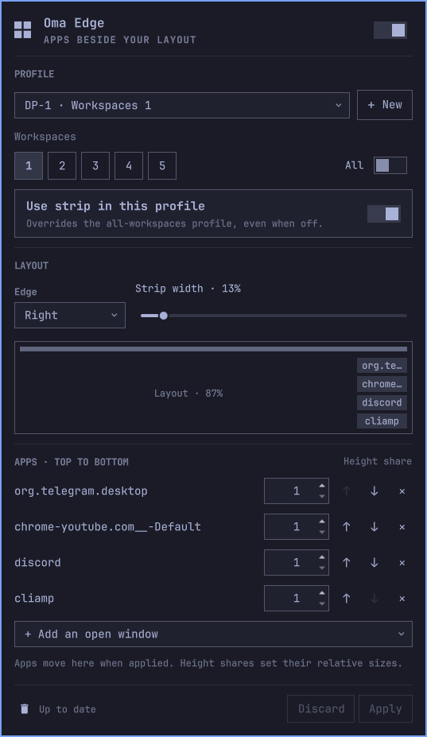

# Oma Edge for Omarchy

Keep real app windows in a reserved strip at the left or right of a monitor,
while Hyprland's native scrolling, dwindle, or master layout uses the rest.
Configure it from a bar panel. No compiled compositor plugin is needed.



## Features

- Per-monitor profiles for one or several workspaces (with shared settings).
- An optional **All workspaces** default, overridden by workspace profiles.
- Width from 10–45%, left or right placement, up to six app slots.
- Pick running windows, reorder them, and adjust relative heights (1–10).
- Remember app classes and reclaim slots when apps reopen.
- Keep the horizontal bar full-width without resizing it on workspace switches.
- Disable the strip or remove assignments to restore the windows' recorded
  workspace, floating/pinned state, and floating geometry.
- Workspace changes and window openings are handled through Hyprland's event
  socket. Changing a profile does not reload the entire desktop.

The plugin does not replace or choose your tiling layout. It doesn't launch
apps automatically; open the apps you want, then assign them from the panel.

## Requirements

Omarchy Quattro (tested on 4.0.4), Hyprland's Lua configuration and typed dispatcher API (tested on
0.56.2), Python 3, Quickshell, and the standard Omarchy shell. Full-width bar
support works with the standard Omarchy bar without a clone.
Other horizontal bars on the normal Top layer also use this mechanism; bars
that reserve space on the Overlay layer may behave differently.

## Installation (manual setup required)

Add the public repository:

```bash
omarchy plugin add https://github.com/dfrost90/oma-edge --enable
```

After adding the plugin,
run the explicit setup step below. Enabling the plugin alone does **not** edit
Hyprland configuration:

```bash
python3 "${XDG_CONFIG_HOME:-$HOME/.config}/omarchy/plugins/io.github.dfrost90.edge-strip/install.py" --check
python3 "${XDG_CONFIG_HOME:-$HOME/.config}/omarchy/plugins/io.github.dfrost90.edge-strip/install.py"
```

The setup command installs a layout-event hook in your user Hyprland configuration
as described below. Review those changes before running it. No root access,
package downloads, or network access are needed by the plugin.

### Install from a source checkout

```bash
python3 install.py --check
python3 install.py
```

The installer links this checkout into
`~/.config/omarchy/plugins/io.github.dfrost90.edge-strip`, installs a guarded
layout-event bridge loader at the beginning of `~/.config/hypr/hyprland.lua`, enables the
plugin, and restarts the shell. Keep the checkout in place while using it.
Running the installer from a plugin already checked out at that destination
also works.

The installer keeps your selected bar and does not clone or patch it. Oma Edge's
service owns transparent, input-transparent side surfaces that reserve space
for app windows after Hyprland places the normal top-layer bar. The bar retains
its full width and its normal service access, including for plugins like OmaChat.
Setup preflights requirements and restores changed configuration if a later step
fails. Backups are kept under `~/.config/omarchy/edge-strip-backups/<timestamp>/`.

## Upgrading from the bar adapter

Rerun `python3 install.py` to reload the reservation service and remove old Oma
Edge adapter blocks from local bar clones (with backups). Your selected bar is
preserved. To return to the standard bar, use `omarchy plugin enable omarchy.bar`.
The old `fullBar` profile setting is still ignored.

## Use

Click the Oma Edge icon in the bar, or run:

```bash
omarchy-shell edge-strip open
```

1. Choose **New** to configure the current monitor/workspace. If that
   profile exists, it opens for editing.
2. Choose a connected monitor using its highlighted button, then toggle the numbered buttons under **Workspaces**.
   Selected buttons are highlighted. The row matches Omarchy’s bar: 1–5,
   plus currently existing workspaces up to 10. The **All workspaces** toggle
   highlights every square and includes future workspaces. Turning it off
   keeps the visible workspaces selected; clicking a square while All is on
   switches to specific selection and deselects that workspace.
   Selected workspaces share one editable profile; conflicts with another
   profile must be resolved before applying.
3. Choose a side and width. Pick open windows with **Add an open window**, reorder with the
   arrows, and set height weights. A 1:2 pair gives the second app twice the
   height of the first.
4. Click **Apply**. The horizontal bar always spans the full screen.

Changes stay in the panel until Apply, except for the global enable switch,
which applies immediately. Discard restores the selected saved profile.

The header switch enables/disables Oma Edge. Monitor buttons hide with one
connected monitor; the workspace row hides when only one workspace choice exists.
Escape or clicking outside closes the panel.

The panel uses Omarchy’s shared UI controls and theme sizing. Tab/Shift+Tab
move between controls; arrow keys adjust the focused width slider. The app
picker supports searching window titles and classes. Escape closes a picker
first, or the panel when no picker is open. Apply/Discard stay visible when
the form scrolls, and the preview reflects width, side, top bar, and app shares.

A workspace-specific profile takes precedence over **All workspaces**. Turn
**Use strip in this profile** off to give that workspace the full desktop,
even when an all-workspaces profile exists.

Windows assigned to a specific workspace stay there and are not pinned across
workspaces. Windows in an all-workspaces profile are pinned while that profile
is active; an explicit workspace override parks unused global apps on the
private `special:edge-strip` workspace. Removing their assignment restores
their original workspace. A single live window shared by several profiles is
claimed by the active profile first.

The strip remains reserved when assigned apps are closed, but its height is
redistributed among present apps according to their height shares. Reopening a
matching app restores its position in the order and recalculates every tile. Identification uses exact window class, preferring
the selected window within the current session. Terminal slots never fall back
to an arbitrary window of the same terminal class: after closing, they reclaim
a window only when its title exactly matches the saved title and is unique.
If that title changes across launches, remove and re-add the intended window. Use separate web-app
windows for sites such as YouTube.

## Configuration and recovery

- `~/.config/omarchy/edge-strip.json`: versioned profiles, source of truth.
- `edge-strip.json.previous`: configuration before the last successful save attempt.
- `$XDG_RUNTIME_DIR/omarchy-edge-strip/`: local control socket, controller state, and
  window recovery journal, limited to the current login/session.
- `reservations.json` in the runtime directory: controller requests consumed by
  the service's side surfaces. Requests are scoped to the current compositor session.
- `bridge.lua`: notifies the controller when monitor geometry or layer reservations
  change. It does not wrap or modify monitor rules.

The controller waits for the compositor to apply side reservations before laying
out apps. Surfaces disappear when the shell/service stops. Existing monitor
settings and reservations remain under your control.

```bash
python3 backend.py request '{"action":"status"}'
python3 backend.py request '{"action":"reapply"}'
```

Turning off **Enable Oma Edge** releases its reservations and restores managed
windows. For complete integration removal:

```bash
python3 uninstall.py
```

This disables the plugin, removes its Lua loader and any legacy bar adapters, and reloads
Hyprland/the shell. It keeps the checkout, profiles, backups, and your local bar
clone. Afterwards, `omarchy plugin remove io.github.dfrost90.edge-strip` is
optional. Use the uninstall script before deleting the source.

## Limits

- Full-width integration is verified with the standard horizontal Omarchy bar.
  No custom clone is required, so upstream bar updates remain available. Arbitrary
  third-party bars (especially Overlay-layer bars) are not guaranteed compatible.
- True fullscreen can cover the strip. Fullscreen and grouped windows aren't
  offered as new assignments. The controller doesn't close applications.
- Windows are floating. Apply, workspace switches, and relevant compositor
  events restore their slot geometry; this is not a hard compositor drag lock.
- App minimum heights are detected after resizing; other tiles share the remaining
  space while retaining gaps. If minimum heights cannot fit, use fewer slots or a
  taller monitor. Apps may also enforce a minimum width; increase strip width if needed.
- Geometry covers scale, rotation and monitor offsets in tests. Physical
  multi-monitor hotplug has not yet been verified on hardware.

## Development and verification

```bash
scripts/check.sh
```

In an explicitly authorized desktop session:

```bash
python3 tests/live_verify.py
```

The live test temporarily changes workspace and strip settings, checks actual
monitor/window/bar geometry, and restores the initial settings in `finally`.
It targets the focused monitor, adapts to its size, and tests a temporary empty
workspace. Run it only when temporary layout changes are acceptable. Physical
multi-monitor behavior still needs hardware verification.

For QML changes in a symlinked checkout, rescan the plugin and restart the shell
when necessary; the shell's file watcher may not follow changes under symlinks.

License: MIT.

## Release status

This checkout is version 0.1.6, a preview with bar-independent reservations. See [CHANGELOG.md](CHANGELOG.md)
and [release/RELEASE.md](release/RELEASE.md) for verification and publication steps.
The persistent plugin ID remains `io.github.dfrost90.edge-strip` for upgrade
compatibility; Oma Edge is its display name. Node.js and Lua are development
test dependencies, not additional runtime services.
